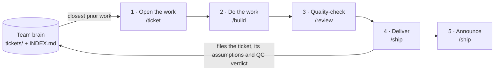
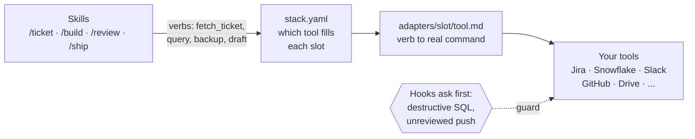

# Ticketwright

[](https://github.com/kyle-chalmers/ticketwright/actions/workflows/ci.yml)
[](https://github.com/kyle-chalmers/ticketwright/releases)
[](LICENSE)


## Mission

**Ticketwright empowers a team to do a high volume of analysis without letting quality slide, on whatever tools they already use.**

## Vision

**Any new or experienced member can pick up any analysis and be productive the same day, because the team's past work is written down and organized, and AI can trace it.**

---

Built for analysts, BI, ops, research and reporting teams whose work product is an answer rather
than a feature. It sits beside your tracker, warehouse and dashboards.

## What it builds: a team brain

Every ticket lands in one folder with its business context, written assumptions, QC verdict and
deliverables. An auto-maintained catalog (`tickets/INDEX.md`) and object map (`tickets/OBJECTS.md`)
make that history searchable by people and agents, so `/ticket` opens new work with the closest
prior work already ranked. Details: [docs/how-it-works.md](docs/how-it-works.md).

## The lifecycle is the map

Every ticket moves through the same five phases, and each shipped ticket feeds the next:



Quality checking has no slot of its own: `/review` borrows the warehouse to re-run your queries,
then a person signs off.

Skills speak to tool slots, never to a vendor, so swapping a tool is one config line and one
adapter file:



Cloud-drive backup needs one machine-local step: [docs/drive-mount.md](docs/drive-mount.md).

| Tool slot | Works with |
|---|---|
| Tracker | Jira, Azure DevOps, Linear, Asana, Monday, GitHub Issues, or none (`id_mode: slug`) |
| Warehouse | Snowflake, BigQuery, Databricks, Postgres, Redshift, Synapse, or none |
| Chat | Slack, Teams, Gmail, Outlook |
| Docs | Google Drive, SharePoint, or Dropbox/S3/Box through rclone |
| Meetings | Zoom, Fireflies, Granola, Teams, Notion (optional) |
| Git | GitHub, GitLab, Azure Repos |

These adapters ship today; another tool is [one more adapter file](adapters/README.md).

## What a working repo looks like

`/setup` writes the top half once. The `tickets/` half grows as the team works: one folder per
person, one folder per ticket, and the same shape inside every ticket. The labels show which step
writes each piece.

```
your-repo/
├── AGENTS.md                  # team rules, read by people and agents alike
├── CLAUDE.md                  # one line: @AGENTS.md
├── bin/tw                     # launcher that finds the installed kit
├── .claude/config/
│   ├── stack.yaml             # which tool fills each slot, plus team policies
│   └── connections.local.yaml # your machine only (gitignored)
├── people/
│   ├── alice.yaml             # one file per teammate: identities, viewer, voice
│   └── bob.yaml
├── documentation/             # the domain knowledge pack
└── tickets/
    ├── INDEX.md               # every owner's tickets in one catalog      (auto)
    ├── OBJECTS.md             # table or view -> tickets that touched it  (auto)
    ├── graph/  objects/       # Obsidian nodes for tickets and tables     (auto)
    ├── bob/
    │   └── TEST-118/          # returns baseline, shipped last month
    └── alice/
        ├── TEST-127/          # shipped
        └── TEST-130/          # in progress, builds on bob's TEST-118
            ├── README.md              /ticket   business context, every assumption
            ├── plan.md                /ticket   the plan you approved
            ├── specs/                 /ticket   the spec, when the plan calls for one
            ├── source_materials/      /ticket   attachments, curated meeting notes
            ├── exploratory_analysis/  /build    scratch queries, kept for the record
            ├── final_deliverables/    /build    01_returns_by_region_1284rows.sql + .csv
            ├── qc_queries/            /build    numbered checks, then /review's verdict
            └── delivery-plan.yaml     /ship     who received it, and where
```

Nobody maintains the catalog by hand. `/ship` files each finished ticket into `INDEX.md`,
`OBJECTS.md` and the graph, and `/ticket` searches every owner's past work, not only yours. When
Alice's TEST-130 mentions Bob's TEST-118, the two are linked, so her reviewer can trace the numbers
back to his. A new teammate adds one `people/` file and gets their own folder. Nothing else changes.

## How work flows

```
/ticket <id>        opens or resumes the ticket, auto-loads its context + closest prior work,
                    writes the plan (and the spec when the plan calls for one), and waits for
                    your approval before anything is built ↓
/build              executes the approved plan or spec in fresh context, then runs /review itself
/review [--deep]    the independent QC pass /build runs for you: re-runs queries, walks the validation
                    pyramid → APPROVE / REQUEST-CHANGES; run it directly to re-check or go --deep
                    …and at the top of that pyramid, opens the deliverables in YOUR apps and waits
/ship [--go]        backup → tracker comment → chat draft → commit + PR — HARD HALT before anything
                    external; warns, waits for a typed `ship unreviewed`, and records it when no
                    review verdict is on file
```

Also: `/setup` (configure once, onboard a teammate), `/refresh` (rebuild the catalog), and
`/skillify` (turn a recurring workflow into its own skill). On a plugin install, prefix each one:
`/ticketwright:ticket`.

## Get started

Install project-scoped, from the root of the repo you work tickets in:

```bash
claude plugin marketplace add https://github.com/kyle-chalmers/ticketwright.git --scope project
claude plugin install ticketwright@ticketwright --scope project
```

Run `/reload-plugins` (or fully quit the app; a new chat is not a restart), then
`/ticketwright:setup`, which detects your tools and interviews you before writing anything. First
person in a repo (Track 1) or joining one (Track 2): [docs/getting-started.md](docs/getting-started.md)
has both, with a prompt to paste to your agent. `autoUpdate` never upgrades the plugin:
[uninstall, install, relaunch](docs/troubleshooting.md#upgrading).

## Safety rails

- Destructive warehouse SQL run through a CLI asks first, even when it's hidden in a `-f` file.
- `/ship` stops before any external post and shows exactly what it will send.
- Pushing a ticket's deliverables with no approving review on file asks first.

Every hook is listed in [docs/how-it-works.md](docs/how-it-works.md#hooks-in-full).

## See it as a graph (Obsidian)

The index also writes `tickets/graph/` and `tickets/objects/`, so opening the repo as an Obsidian
vault shows which tickets touched which tables. See [docs/obsidian.md](docs/obsidian.md).

## Learn more

- [docs/getting-started.md](docs/getting-started.md): install tracks, what setup writes, adopting
  a repo, pip and other runtimes
- [docs/how-it-works.md](docs/how-it-works.md): the lifecycle, voice profiles, every hook
- [docs/architecture.md](docs/architecture.md): adapters, the verb contract, adding a tool
- [docs/troubleshooting.md](docs/troubleshooting.md): failed skills, unreachable tools, upgrades
- [docs/obsidian.md](docs/obsidian.md) and [docs/drive-mount.md](docs/drive-mount.md)
- [CONTRIBUTING.md](CONTRIBUTING.md) · [ROADMAP.md](ROADMAP.md) · [CHANGELOG.md](CHANGELOG.md)

## License

MIT, see [`LICENSE`](LICENSE).
